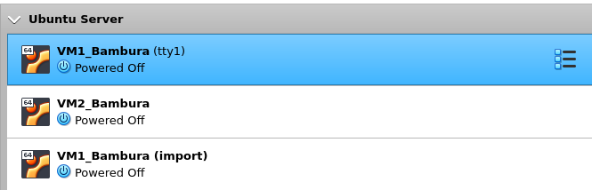
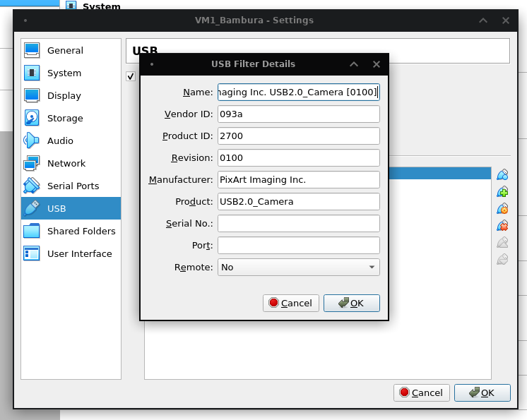
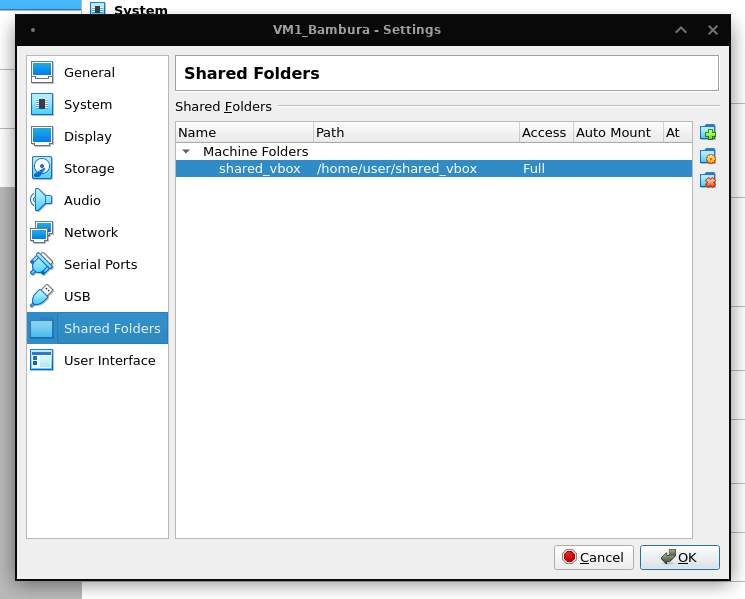

# Task 2.1

## Part 1. HYPERVISORS

### 1. What are the most popular hypervisors for infrastructure virtualization?

The most popular hypervisors are:
- VMware ESXi/vSphere;
- Microsoft Hyper-V;
- Citrix XenServer;
- Oracle VirtualBox;
- Parallels Hypervisor;
- Red Hat Enterprise Virtualization;

### 2. Briefly describe the main differences of the most popular hypervisors.

There are two types of hypervisors:
- Type 1 hypervisor: hypervisors run directly on the system hardware – A “bare metal” embedded hypervisor,
- Type 2 hypervisor: hypervisors run on a host operating system that provides virtualization services, such as I/O device support and memory management.

## Part 2. WORK WITH VIRTUALBOX

### Group



### USB



### Shared folder



### VBoxManage list

```console
$ VBoxManage list vms
"VM1_Bambura" {96a8554e-ec5a-4f99-939c-ac5cd882d503}
"VM2_Bambura" {b3c994e6-6ca0-469c-b0d2-a2f56676b337}
"VM1_Bambura (import)" {4c935e6f-933b-4878-a680-97f52aef8850}
```

## Part 3. WORK WITH VAGRANT

### Date command executed in VM

```console
$ ssh -p 2222 vagrant@127.0.0.1
The authenticity of host '[127.0.0.1]:2222 ([127.0.0.1]:2222)' can't be established.
ECDSA key fingerprint is SHA256:+zgKqxyYlTBxVO0xtTVGBokreS9Zr71wQGvnG/k2igw.
This key is not known by any other names
Are you sure you want to continue connecting (yes/no/[fingerprint])? yes
Warning: Permanently added '[127.0.0.1]:2222' (ECDSA) to the list of known hosts.
vagrant@127.0.0.1's password: 
Welcome to Ubuntu 12.04 LTS (GNU/Linux 3.2.0-23-generic x86_64)

 * Documentation:  https://help.ubuntu.com/
Your Ubuntu release is not supported anymore.
For upgrade information, please visit:
http://www.ubuntu.com/releaseendoflife

New release '14.04.6 LTS' available.
Run 'do-release-upgrade' to upgrade to it.

Welcome to your Vagrant-built virtual machine.
Last login: Fri Sep 14 06:23:18 2012 from 10.0.2.2
vagrant@precise64:~$ date
Wed Nov 10 16:34:13 UTC 2021
```

### Packaging a box

```console
$ vagrant package --output ubuntu_nginx.box
==> default: Exporting VM...
==> default: Compressing package to: /mnt/8664818a-863b-491f-af74-3a976a33c843/bambura/ubuntu_nginx.box
```
