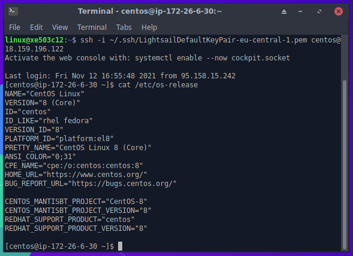
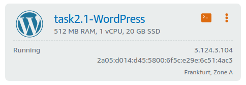
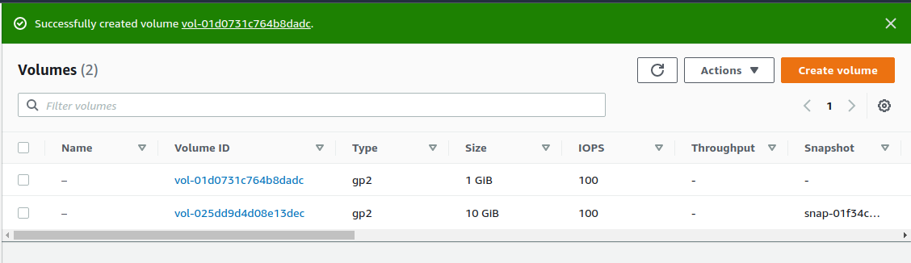
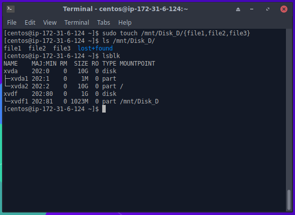

# Task 2.2

## Lightsail



## Lightsail Wordpress



## Created volume and snapshot



## Disk_D



## Docker container uploaded to ECR

```console
[centos@ip-172-31-6-124 ~]$ aws ecr create-repository --repository-name hello-repository --region eu-central-1
{
    "repository": {
        "repositoryArn": "arn:aws:ecr:eu-central-1:350332161713:repository/hello-repository",
        "registryId": "350332161713",
        "repositoryName": "hello-repository",
        "repositoryUri": "350332161713.dkr.ecr.eu-central-1.amazonaws.com/hello-repository",
        "createdAt": 1637010251.0,
        "imageTagMutability": "MUTABLE",
        "imageScanningConfiguration": {
            "scanOnPush": false
        },
        "encryptionConfiguration": {
            "encryptionType": "AES256"
        }
    }
}
[centos@ip-172-31-6-124 ~]$ docker tag hello-world 350332161713.dkr.ecr.eu-central-1.amazonaws.com/hello-repository
[centos@ip-172-31-6-124 ~]$
[centos@ip-172-31-6-124 ~]$ aws ecr get-login-password | docker login --username AWS --password-stdin 350332161713.dkr.ecr.eu-central-1.amazonaws.com
WARNING! Your password will be stored unencrypted in /home/centos/.docker/config.json.
Configure a credential helper to remove this warning. See
https://docs.docker.com/engine/reference/commandline/login/#credentials-store

Login Succeeded
[centos@ip-172-31-6-124 ~]$ docker push 350332161713.dkr.ecr.eu-central-1.amazonaws.com/hello-repository
Using default tag: latest
The push refers to repository [350332161713.dkr.ecr.eu-central-1.amazonaws.com/hello-repository]
7fafd282f4ac: Pushed 
72d07f3a7798: Pushed 
efaa81453db1: Pushed 
824bf068fd3d: Pushed 
latest: digest: sha256:b5e640e800197f35e71a632e49b8f908f120fc49524cedc352e57df151a03591 size: 1155
```

## Website uploaded to S3

http://15-website.s3-website.eu-central-1.amazonaws.com/
