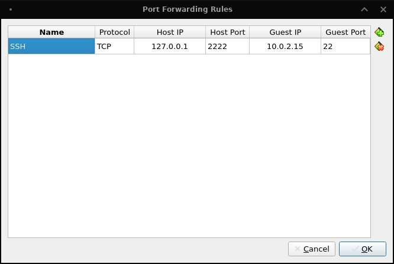

# TASK5.3

## Part1

### 1. How many states could has a process in Linux?

Linux has 5 states of process:
- 'D' = UNINTERRUPTABLE_SLEEP
- 'R' = RUNNING & RUNNABLE
- 'S' = INTERRRUPTABLE_SLEEP
- 'T' = STOPPED
- 'Z' = ZOMBIE

### 2. Examine the pstree command. Make output (highlight) the chain (ancestors) of the current process.

To highlight the chain of the current process the `pstree -h` command is used.

### 3. What is a proc file system?

The proc filesystem is a pseudo-filesystem which provides an interface to kernel data structures. It is commonly mounted at /proc.

It contains useful information about the processes that are currently running, it is regarded as control and information center for kernel.

### 4. Print information about the processor (its type, supported technologies, etc.).

```console
jenneron@xe503c12:~$ cat /proc/cpuinfo
processor	: 0
model name	: ARMv7 Processor rev 3 (v7l)
BogoMIPS	: 24.00
Features	: half thumb fastmult vfp edsp neon vfpv3 tls vfpv4 idiva idivt vfpd32 lpae evtstrm 
CPU implementer	: 0x41
CPU architecture: 7
CPU variant	: 0x2
CPU part	: 0xc0f
CPU revision	: 3

processor	: 1
model name	: ARMv7 Processor rev 3 (v7l)
BogoMIPS	: 24.00
Features	: half thumb fastmult vfp edsp neon vfpv3 tls vfpv4 idiva idivt vfpd32 lpae evtstrm 
CPU implementer	: 0x41
CPU architecture: 7
CPU variant	: 0x2
CPU part	: 0xc0f
CPU revision	: 3

processor	: 2
model name	: ARMv7 Processor rev 3 (v7l)
BogoMIPS	: 24.00
Features	: half thumb fastmult vfp edsp neon vfpv3 tls vfpv4 idiva idivt vfpd32 lpae evtstrm 
CPU implementer	: 0x41
CPU architecture: 7
CPU variant	: 0x2
CPU part	: 0xc0f
CPU revision	: 3

processor	: 3
model name	: ARMv7 Processor rev 3 (v7l)
BogoMIPS	: 24.00
Features	: half thumb fastmult vfp edsp neon vfpv3 tls vfpv4 idiva idivt vfpd32 lpae evtstrm 
CPU implementer	: 0x41
CPU architecture: 7
CPU variant	: 0x2
CPU part	: 0xc0f
CPU revision	: 3

processor	: 4
model name	: ARMv7 Processor rev 3 (v7l)
BogoMIPS	: 96.00
Features	: half thumb fastmult vfp edsp neon vfpv3 tls vfpv4 idiva idivt vfpd32 lpae evtstrm 
CPU implementer	: 0x41
CPU architecture: 7
CPU variant	: 0x0
CPU part	: 0xc07
CPU revision	: 3

processor	: 5
model name	: ARMv7 Processor rev 3 (v7l)
BogoMIPS	: 96.00
Features	: half thumb fastmult vfp edsp neon vfpv3 tls vfpv4 idiva idivt vfpd32 lpae evtstrm 
CPU implementer	: 0x41
CPU architecture: 7
CPU variant	: 0x0
CPU part	: 0xc07
CPU revision	: 3

processor	: 6
model name	: ARMv7 Processor rev 3 (v7l)
BogoMIPS	: 96.00
Features	: half thumb fastmult vfp edsp neon vfpv3 tls vfpv4 idiva idivt vfpd32 lpae evtstrm 
CPU implementer	: 0x41
CPU architecture: 7
CPU variant	: 0x0
CPU part	: 0xc07
CPU revision	: 3

processor	: 7
model name	: ARMv7 Processor rev 3 (v7l)
BogoMIPS	: 96.00
Features	: half thumb fastmult vfp edsp neon vfpv3 tls vfpv4 idiva idivt vfpd32 lpae evtstrm 
CPU implementer	: 0x41
CPU architecture: 7
CPU variant	: 0x0
CPU part	: 0xc07
CPU revision	: 3

Hardware	: Samsung Exynos (Flattened Device Tree)
Revision	: 0000
Serial		: 0000000000000000
```

### 5. Use the ps command to get information about the process. The information should be as follows: the owner of the process, the arguments with which the process was launched for execution, the group owner of this process, etc.

```console
jenneron@xe503c12:~$ ps -af | tail -5 # the output is cut out to not fill this readme.md with all my processes
jenneron 20592  5722  1 10:10 tty3     00:00:23 xfce4-terminal
jenneron 20846  6116 66 10:12 tty3     00:18:14 /usr/lib/chromium-browser/chromium-browser --type=renderer --enable-crashpad --crashpad-handler-pid=0 --enable-crash-reporter=,Built on Ubuntu , running on Debian unstable --disable-client-side-phishing-detection --display-capture-permissions-policy-allowed --change-stack-guard-on-fork=enable --ozone-platform=wayland --field-trial-handle=1223655971335271895,15001211260868424672,131072 --enable-features=UseOzonePlatform --disable-gpu-compositing --lang=en-US --num-raster-threads=4 --enable-zero-copy --enable-main-frame-before-activation --renderer-client-id=71 --shared-files=v8_context_snapshot_data:100
jenneron 20879  6116  0 10:12 tty3     00:00:01 /usr/lib/chromium-browser/chromium-browser --type=renderer --enable-crashpad --crashpad-handler-pid=0 --enable-crash-reporter=,Built on Ubuntu , running on Debian unstable --disable-client-side-phishing-detection --display-capture-permissions-policy-allowed --change-stack-guard-on-fork=enable --ozone-platform=wayland --field-trial-handle=1223655971335271895,15001211260868424672,131072 --enable-features=UseOzonePlatform --disable-gpu-compositing --lang=en-US --num-raster-threads=4 --enable-zero-copy --enable-main-frame-before-activation --renderer-client-id=72 --shared-files=v8_context_snapshot_data:100
jenneron 26123 20661  0 10:39 pts/1    00:00:00 ps -af
jenneron 26124 20661  0 10:39 pts/1    00:00:00 tail -5
```

### 6. How to define kernel processes and user processes?

In it’s life span a process executes in user mode and kernel mode. The User mode is normal mode where the process has limited access. While the Kernel mode is the privileged mode where the process has unrestricted access to system resources like hardware, memory, etc.

The process can be transferred from user mode to kernel mode to execute system call.

Kernel mode processes can be read only by the kernel.

### 7. Print the list of processes to the terminal. Briefly describe the statuses of the processes. What condition are they in, or can they be arriving in?

```console
jenneron@xe503c12:~$ ps -au | head -5
USER       PID %CPU %MEM    VSZ   RSS TTY      STAT START   TIME COMMAND
root       632  0.0  0.1   9768  4080 tty2     Ss   Jan11   0:00 /bin/login -p --
jenneron   666  0.0  0.1  22568  5944 tty2     S+   Jan11   0:00 -bash
root       963  0.0  0.1   9768  4172 tty3     Ss   Jan11   0:00 /bin/login -p --
root       964  0.0  0.0   6976  2096 tty4     Ss+  Jan11   0:00 /sbin/agetty -o -p -- \u --noclear tty4 linux
```

Here we can see statuses of processes (S+, Ss, Ss+), here are some meanings:
- `S` means interruptible sleep state;
- `s` means session leader;
- `+` means the process in foreground.

### 8. Display only the processes of a specific user.

```console
jenneron@xe503c12:~$ ps -f -U root | head -5
UID        PID  PPID  C STIME TTY          TIME CMD
root         1     0  0 Jan11 ?        00:00:06 /sbin/init
root         2     0  0 Jan11 ?        00:00:00 [kthreadd]
root         3     2  0 Jan11 ?        00:00:00 [rcu_gp]
root         4     2  0 Jan11 ?        00:00:00 [rcu_par_gp]
```

### 9. What utilities can be used to analyze existing running tasks (by analyzing the help for the ps command)?

`ps`' man page suggests to check `pgrep`, `pstree`, `top`, `proc` commands.

### 10. What information does top command display?

`top` command displays information about the processes:
- PID;
- USER: user;
- PRI: priority;
- NI: nice value;
- VIRT: amount of used virtual memory;
- RES: amount of used resident memory;
- SHR: amount of used shared memory;
- S: status;
- %CPU: the share of CPU time;
- %MEM: the share of physical memory;
- TIME+: total CPU time;
- COMMAND: command name;

It also displays some general information about the system at the top:
- time;
- uptime;
- the amount of users;
- load average;
- amount of running tasks total and by type;
- cpu, memory and swap load.

### 12. Display the processes of the specific user using the top command.

```console
$ top -U root
```

### 12. What interactive commands can be used to control the top command? Give a couple of examples.

Interactive commands from man page:
```
4a. Global-Commands
      <Ent/Sp> ?, =, 0,
      A, B, d, E, e, g, h, H, I, k, q, r, s, W, X, Y, Z
4b. Summary-Area-Commands
      C, l, t, m, 1, 2, 3, 4, !
4c. Task-Area-Commands
      Appearance:  b, J, j, x, y, z
      Content:     c, F, f, O, o, S, U, u, V, v
      Size:        #, i, n
      Sorting:     <, >, f, R
4d. Color-Mapping
      <Ret>, a, B, b, H, M, q, S, T, w, z, 0 - 7
5b. Commands-for-Windows
      -, _, =, +, A, a, g, G, w
5c. Scrolling-a-Window
      C, Up, Dn, Left, Right, PgUp, PgDn, Home, End
5d. Searching-in-a-Window
      L, &
```

### 13. Sort the contents of the processes window using various parameters (for example, the amount of processor time taken up, etc.)

- sorting by PID: `top -o PID`;
- sorting by process time taken up: `top -o TIME+`.

### 14. Concept of priority, what commands are used to set priority?

There are a total of 140 priorities and two distinct priority ranges implemented in Linux. The first one is a nice value (niceness) which ranges from -20 (highest priority value) to 19 (lowest priority value) and the default is 0. The other is the real-time priority, which ranges from 1 to 99 by default, then 100 to 139 are meant for user-space.

We can check the nice value of processes using `ps -eo pid,ni,command` command:

```console
jenneron@xe503c12:~$ ps -eo pid,ni,command | head -5
  PID  NI COMMAND
    1   0 /sbin/init
    2   0 [kthreadd]
    3 -20 [rcu_gp]
    4 -20 [rcu_par_gp]
```

Some additional commands:
- Running new command with specifying nice value: `nice -n niceness-value [command args]`;
- Changing the nice value of process: `renice -n -12 -p PID`;
- Changing the nice value of user's processes:`renice -n -2  -u username`.

### 15. Can I change the priority of a process using the top command? If so, how?

Once given `top` command, press `r`. Give PID value of the process you want to change the process value. Give `renice` value (from -20 to +19).

### 16. Examine the kill command. How to send with the kill command process control signal? Give an example of commonly used signals.

`kill` syntax:
- `kill PID`;
- `kill -s signalname PID`;
- `kill -signalname PID`;
- `kill -signalnumber PID`.

Below are the list of Signals and their descriptions:
- SIGTRAP – The main purpose of SIGTRAP command signal is to debug a process. When a signal is sent to a process and it is waiting for an action or condition to meet the debugger then this signal will be sent.
- SIGABRT – This SIGABRT kill signal is used for aborting the processing signal. Basically, a process is initiated to SIGABRT to kill the signal on its own.
- SIGBUS – Whenever a program sends the SIGBUS signal, it happens to be caused by a bus error. Generally, the bus errors are because of a program that tries to utilize duplicate physical addresses or it might be due to the program that may have its memory settings that is set incorrectly.
- SIGCHLD – Whenever a parent program does not find its child process, then the parent program sends the - SIGCHLD signal. This is used to clear up the resources which are used by the child program.
- SIGPROF – Whenever any process is using CPU Time then the SIGPROF signal is sent by the system when the program is elapsing.
- SIGPOLL – Whenever a program is causing any non-concurrent I/O actions, then that program will send the SIGPOLL signal.

### 17. Commands jobs, fg, bg, nohup. What are they for? Use the sleep, yes command to demonstrate the process control mechanism with fg, bg.

- `jobs` command prints running jobs;
- `fg` command returns stopped job to foreground;
- `bg` command returns stopped job to background;
- `nohup` sends the process to new parent.

Some demonstration:
```console
jenneron@xe503c12:~$ sleep 15
^Z
[1]+  Stopped                 sleep 15
jenneron@xe503c12:~$ sleep 10
^Z
[2]+  Stopped                 sleep 10
jenneron@xe503c12:~$ bg 2
[2]+ sleep 10 &
jenneron@xe503c12:~$ fg
sleep 15
[2]-  Done                    sleep 10
```

## Part2

### 1. Check the implementability of the most frequently used OPENSSH commands in the MS Windows operating system. (Description of the expected result of the commands + screenshots: command – result should be presented)

I don't have Windows installed

### 2. Implement basic SSH settings to increase the security of the client-server connection (at least

1. Create new user and password on the server.
1. Copy your keys to the server:
```console
$ ssh-copy-id user@host
```
2. Disable root login and password authentification in `/etc/ssh/sshd_config`:
```
PermitRootLogin no
PasswordAuthentication no
```

### 3. List the options for choosing keys for encryption in SSH. Implement 3 of them.

Here are some of them:
- HostKey;
- PubkeyAuthentication;
- AuthorizedKeysFile;
- AuthorizedKeysCommand;
- AuthorizedKeysCommandUser.

Example of implementation:
```
HostKey /etc/ssh/ssh_host_rsa_key
PubkeyAuthentication yes
AuthorizedKeysFile .ssh/authorized_keys
```

### 4. Implement port forwarding for the SSH client from the host machine to the guest Linux virtual machine behind NAT.



```console
$ ssh -p 2222 user@127.0.0.1
The authenticity of host '[127.0.0.1]:2222 ([127.0.0.1]:2222)' can't be established.
ED25519 key fingerprint is SHA256:hziy/c8XADlSrrHv/y6Vv5kRcN9wh1xyMHW1BdHX/Wg.
This key is not known by any other names
Are you sure you want to continue connecting (yes/no/[fingerprint])?
```

### 5*. Intercept (capture) traffic (tcpdump, wireshark) while authorizing the remote client on the server using ssh, telnet, rlogin. Analyze the result.
