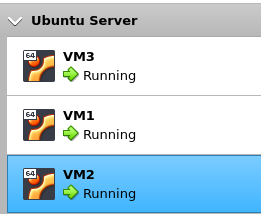
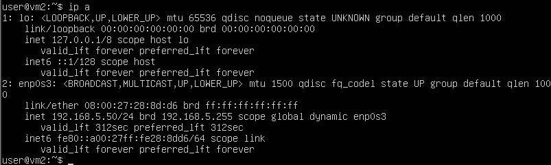
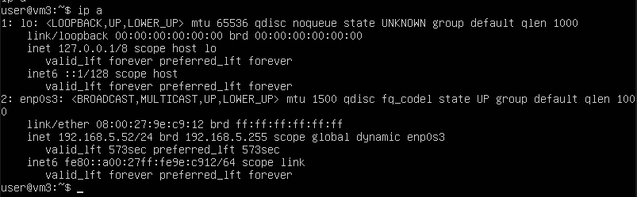
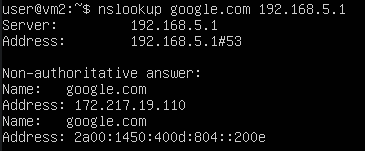
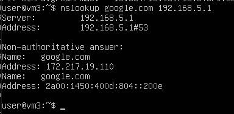

# Task 6.2

## 1. Use already created internal-network for three VMs (VM1-VM3). VM1 has NAT and internal, VM2, VM3 – internal only interfaces.

As i have DHCP server on VM1 and configured client on VM2, the only thing i need is to create a VM3 from VM2, here we go:



## 2. Install and configure DHCP server on VM1.

I a bit overcompleted task 6.1, so i already have DHCP.

## 3. Check VM2 and VM3 for obtaining network addresses from DHCP server.





## 4. Using existed network for three VMs (from p.1) install and configure DNS server on VM1. (You can use DNSMASQ, BIND9 or something else).

### Install bind9 DNS server

```console
$ sudo apt install bind9
```

### Enable IPv4

`/etc/default/named`:

```
OPTIONS="-u bind -4"
```

### Enable DNS in ufw

```console
$ sudo ufw allow 53
$ sudo ufw reload
```

## 5. Check VM2 and VM3 for gaining access to DNS server (naming services).




